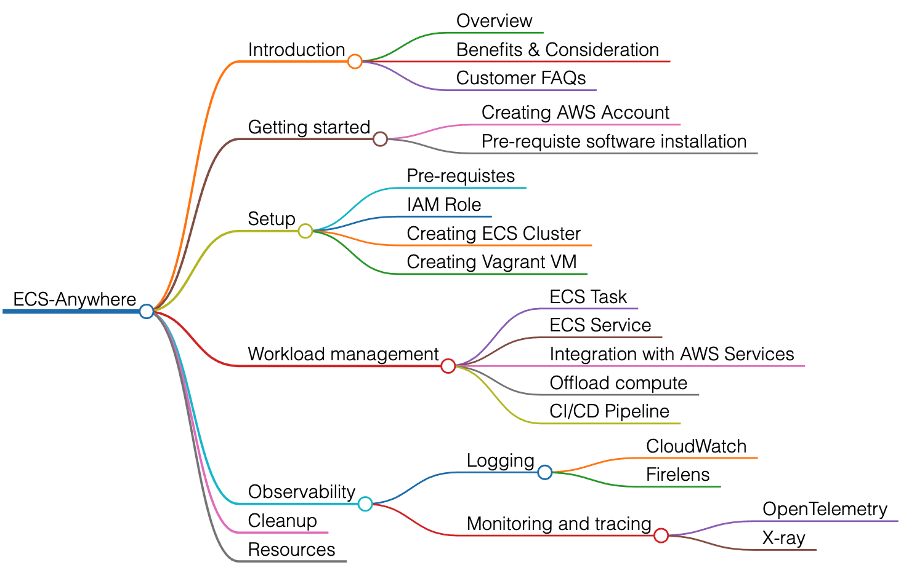

# Welcome to the ECS-Anywhere Workshop!

The intent of this workshop is to educate users about the ECS-Anywhere and their different use-cases. As part of this workshop we also covering how to set up the ECS-Anywhere, different workload management and observability tools to monitor the ECS-Anywhere cluster. We recommend this workshop for Cloud Architects, SREs, DevOps engineers, and other IT Professionals.

Here is the high level view of all the epics covered part of this workshop

